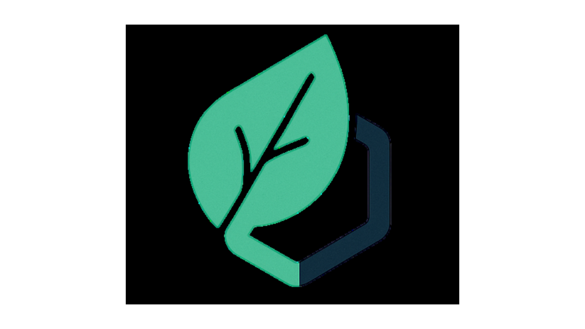
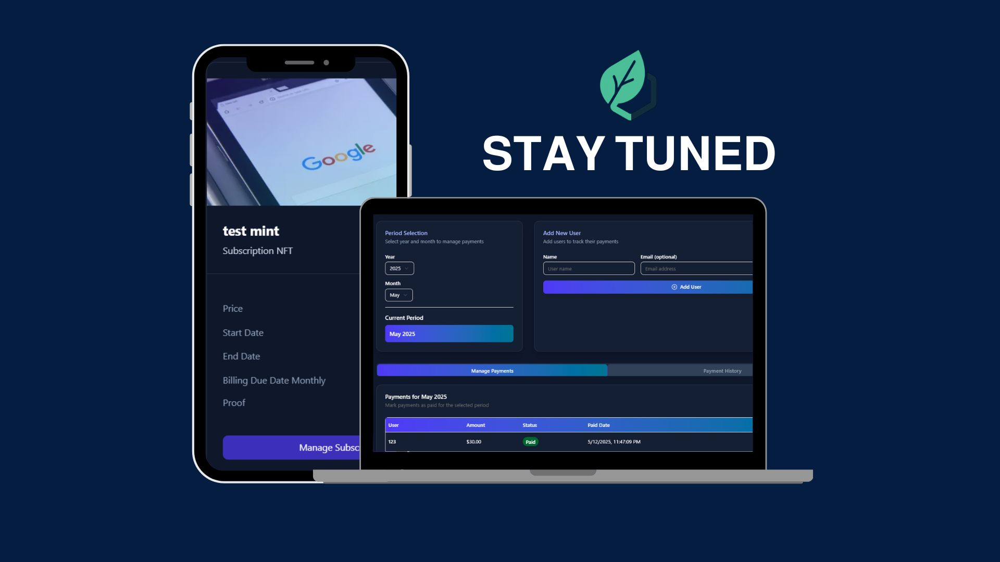

[](https://github.com/yourusername/sub-mint/releases) [](https://github.com/yourusername/sub-mint/blob/main/LICENSE) [](https://nextjs.org/) [](https://solana.com/) [](https://supabase.com/) [](https://tailwindcss.com/) [](https://pinata.cloud/) [](https://replicate.com/)




🚀 Overview
-----------

SubMint is a decentralized subscription manager that tokenizes shared subscriptions as NFTs, enabling on-chain tracking, transparency, and ownership. Perfect for friends, families, or roommates sharing streaming services, software licenses, or any recurring subscription.

✨ Features
----------

*   **NFT Subscription Management**: Convert any subscription into an on-chain NFT
    
*   **Wallet-Free Onboarding**: Use first, connect later with our built-in burner wallet system
    
*   **Shared Expense Tracking**: Add multiple users to a subscription and track payment statuses
    
*   **Payment History**: View comprehensive payment records by month and year
    
*   **Proof of Ownership**: Verify subscription ownership through blockchain validation
    
*   **Visual Subscription Cards**: Generate beautiful visual representations of your subscriptions
    

🔧 Tech Stack
-------------

*   **Frontend**: Next.js 14, React, Tailwind CSS, Shadcn UI
    
*   **Blockchain**: Solana (Devnet)
    
*   **Authentication**: Supabase Auth
    
*   **Database**: Supabase PostgreSQL
    
*   **Storage**: IPFS via Pinata
    
*   **Wallet Infrastructure**: Custom burner wallet implementation
    

📋 Prerequisites
----------------

*   Node.js 18+
    
*   npm or yarn
    
*   Solana CLI tools (optional)
    
*   Supabase account
    
*   Pinata account for IPFS storage
    

🛠️ Installation
----------------

1. Clone the repository:
   ```bash
   git clone https://github.com/shawnchee/sub-mint.git
   cd sub-mint

2. Install Dependencies
    ```bash
    npm install
    # or
    yarn install

3. Set up environmental variables:
    ```bash
    cp .env.example .env.local

4. Update .env.local with your own API keys:
    ```bash
    NEXT_PUBLIC_SUPABASE_URL=your_supabase_url
    NEXT_PUBLIC_SUPABASE_ANON_KEY=your_supabase_anon_key
    PINATA_API_KEY=your_pinata_api_key
    PINATA_SECRET_KEY=your_pinata_secret_key

5. Start the development server:
    ```bash
    npm run dev
    # or
    yarn dev


📱 Usage
--------

1.  **Create a Subscription NFT**:
    
    *   Enter subscription details (name, price, dates)
        
    *   Add users who share the subscription
        
    *   Generate or upload a visual representation
        
    *   Mint the subscription as an NFT
        
2.  **Track Payments**:
    
    *   View all shared subscriptions
        
    *   Mark payments as paid/unpaid
        
    *   See payment history by month and year
        
3.  **Share Access**:
    
    *   Invite others to your subscription management dashboard
        
    *   Track who has paid their share
        

💡 Key Innovations
------------------

### No-Setup Web3 Access

Users can interact with blockchain functionality immediately without installing a wallet or understanding crypto concepts.

### On-Chain Subscription Verification

All subscription details are verifiable on-chain, providing transparency and immutability.

### Shared Subscription Management

Simplifies the complex process of tracking shared expenses among multiple parties.

🤝 Contributing
---------------

Contributions are welcome! Please feel free to submit a Pull Request.

1.  Fork the repository
    
2.  Create your feature branch (git checkout -b feature/amazing-feature)
    
3.  Commit your changes (git commit -m 'Add some amazing feature')
    
4.  Push to the branch (git push origin feature/amazing-feature)
    
5.  Open a Pull Request
    

📄 License
----------

This project is licensed under the MIT License - see the LICENSE file for details.

📞 Contact
----------

Project Link: [Click Here!](https://github.com/Shawnchee/SubMint)

Connect with me on [LinkedIn](https://www.linkedin.com/in/shawn-chee-b39384267/)


<h2 align="center">
  Built with ❤️ by Shawn Chee/SubMint
</h2>
